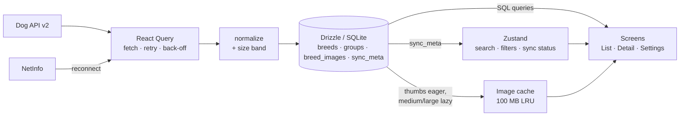
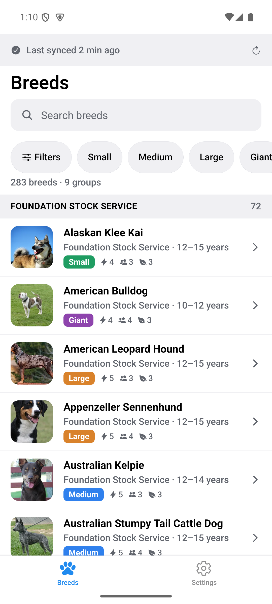
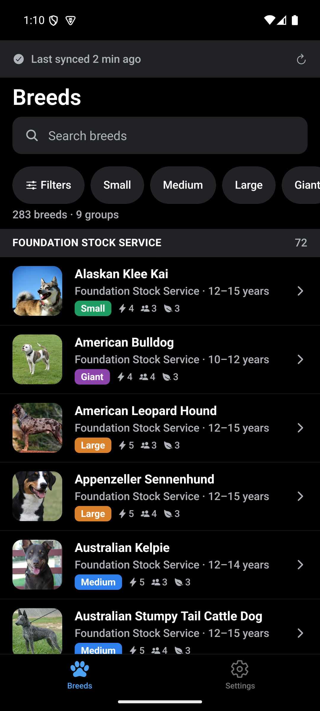
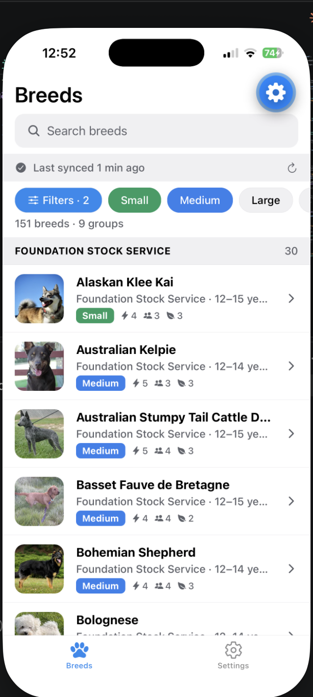
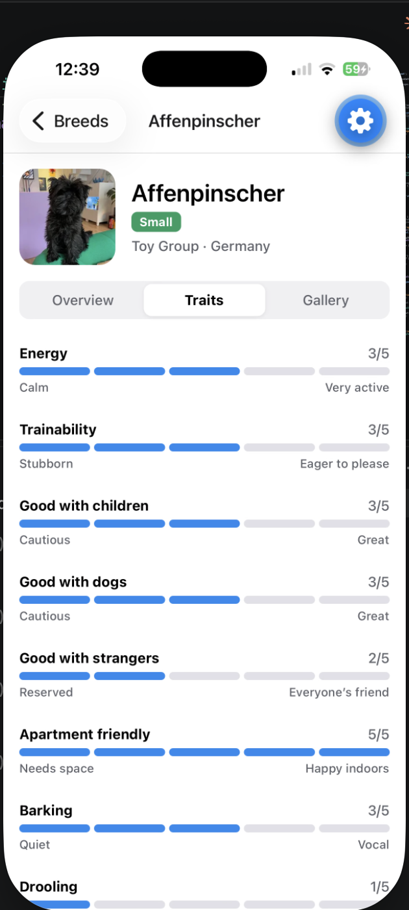
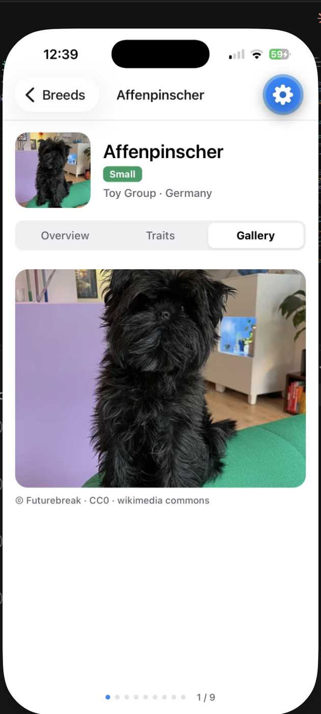
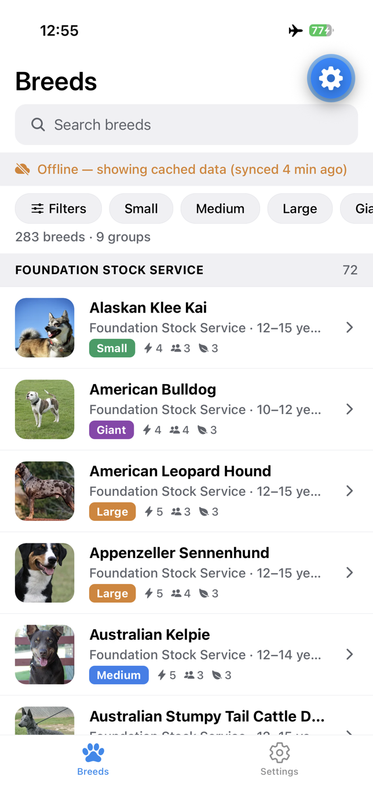

# Tripare Dog Breed Explorer

An offline-first Expo (SDK 57) app that lets you browse, search and filter all 283 breeds
from [Dog API v2](https://dogapi.dog), with a detail screen for each breed (overview, trait
gauges, photo gallery with attribution). Everything renders from a local SQLite cache, so the
app works identically with or without a connection.

## Quick start

```bash
npm install
cp .env.example .env
npm run ios        # or: npm run android
```

`npm run ios` / `npm run android` start the Metro dev server and open the app in the iOS
Simulator / Android emulator. To run on a physical phone instead, `npx expo start` and scan
the QR code with Expo Go.

**Environment.** The only variable is `EXPO_PUBLIC_DOG_API_BASE_URL`, which defaults to
`https://dogapi.dog/api/v2` and normally needs no change. **Dog API v2 requires no API key**,
so there are no secrets to configure; `.env.example` exists so the base URL can be pointed at
a mirror or a mock server.

Verified on a clean `git clone` into an empty directory: `npm ci` 9 s, `npm test` 10 s (93
tests), first Metro bundle 21 s; about 40 s end to end on a warm npm cache.

Other scripts:

```bash
npm test            # jest: unit, component (RNTL) and SQLite integration tests
npm test -- perf    # data-layer benchmark, prints medians
npm run typecheck   # tsc --noEmit
npm run lint        # expo lint
npm run db:generate # drizzle-kit generate, after editing src/db/schema.ts
npm run e2e         # Maestro end-to-end flow (see below)
```

### End-to-end test (Maestro)

Maestro was chosen over Detox because the app runs in Expo Go: Maestro drives the UI of any
installed app, so no custom dev client or native build is needed.

```bash
curl -Ls "https://get.maestro.mobile.dev" | bash     # one-time install (needs Java 17+)
npx expo start --android                              # Metro on :8081, installs Expo Go on the emulator
maestro test e2e/breed-search-flow.yaml               # or: npm run e2e
```

The flow (`e2e/breed-search-flow.yaml`) opens the project in Expo Go, waits for the first
sync, searches for a breed, applies a size filter, opens the detail screen, and verifies that
the Traits tab renders gauges and the Gallery tab shows an image with attribution. It targets
an Android emulator by default (`exp://10.0.2.2:8081`); pass `-e EXPO_URL=…` for another host.

## Architecture overview

On first launch the app pulls the full catalogue from Dog API v2 (283 breeds across 6 pages,
9 groups, ~2,350 photos with author/license attribution), normalizes it, and writes it into
SQLite through Drizzle ORM. From then on every screen reads from SQLite. The network is only
used to refresh that cache: a full resync when the data is older than an hour or when
connectivity returns, and a single-breed refresh when a detail row is stale.

Server state and UI state live in different tools. TanStack React Query owns fetching, retry
and back-off, but its results are written to SQLite before anything renders them, so its
memory cache is never the source of truth. Zustand owns what the user is doing right now:
search text, active filters, and the sync status shown in the banner.

Images use a two-tier cache: one thumbnail per breed is downloaded right after each sync so
the list works offline; medium and large photos are downloaded only when a gallery is
opened, under a 100 MB cap with least-recently-used eviction.



`app/` holds only Expo Router route files, each a thin re-export of a screen in
`src/screens`; all logic lives under `src/`. Full detail, including the folder layout and the
testing layers, is in [docs/ARCHITECTURE.md](docs/ARCHITECTURE.md).

## Data flow: API → cache → UI

`useOfflineSync` runs once at the root. It hydrates the sync store from `sync_meta`, then
calls `runSync`, which fetches groups and all breed pages through React Query (3 retries,
1 s → 2 s → 4 s back-off), validates and normalizes each record (deriving the size band),
and upserts breeds, groups and image rows into SQLite in one transaction. Breeds missing from
a fetch are pruned only when every page arrived; a partial fetch writes what came back and is
recorded as `partial`, so cached data is never wiped by a flaky network. After the write, the
primary thumb of each breed is prefetched. Screens then query SQLite through small repository
functions: the list runs one query with the current search and filters and groups the rows
into sticky sections; the detail layout reads one breed and its images and refreshes it in
the background only if the row is stale. NetInfo triggers a resync when the device comes back
online, and the banner reads its five states (syncing, offline with data, offline without
data, failed, partial) from the sync store.

## Key technical decisions

Summarized from [docs/DECISIONS.md](docs/DECISIONS.md), which has the rationale for each.

- **Zustand for UI state, React Query for server state.** Different change rates and
  guarantees; React Query is a fetch/retry layer here, not a render cache.
- **Drizzle + expo-sqlite** over AsyncStorage/MMKV so search and filters run as indexed SQL
  rather than JavaScript scans over nested objects. One wide `breeds` row per breed, one
  `breed_images` row per image×variant carrying attribution and cache bookkeeping, keyed
  `sync_meta`.
- **Upsert-not-replace sync**, NetInfo-triggered background resync, de-duplicated triggers,
  and `sync_meta` tracking so "last synced" always points at real data.
- **Size bands from max adult weight**: small ≤ 10 kg, medium ≤ 25, large ≤ 45, giant above;
  chosen on the dataset's quartiles and kennel-club conventions (59 / 92 / 94 / 38 breeds).
- **Eager thumbs, lazy medium/large**, 100 MB cap, LRU eviction with non-thumbs first; the
  cache index lives in SQLite so eviction is a query.
- **Payload per row, not row count**, is the list's performance risk: narrow row query,
  fixed 88 pt rows and 36 pt headers (FlashList v2 has no `estimatedItemSize`), memoized
  rows with three badges, filtering in SQLite, one flat recycler with sticky headers.
- **Detail tabs are nested routes** (`/breed/:id`, `/traits`, `/gallery`) via Expo Router's
  headless tabs, with a route-level error boundary.

## Performance report

Measured on an iPhone 16 Pro in Expo Go (development bundle). Full tables and method in
[docs/PERFORMANCE.md](docs/PERFORMANCE.md).

| Metric | Result |
|---|---|
| JS bundle (production Hermes bytecode) | iOS 3.52 MB · Android 3.80 MB |
| Load to first breed row with cached data | 266–284 ms (target < 3 s) |
| Scroll through all 283 breeds | UI 60 fps · JS 56–60 fps |
| Search / filter interactions | 60 fps · list re-query 18–55 ms |
| JS heap with the full list mounted | 31–39 MB (target < 150 MB) |
| Full sync (6 pages + 7,062 image rows + thumb prefetch) | 8.9 s, in the background |

The process-level RAM Expo's monitor shows (322–478 MB) is the Expo Go host including its
dev tooling; the app's own heap is the Hermes figure. A standalone build was not produced
for this submission.

## Screenshots

| Breed list (light) | Breed list (dark) | Filters applied |
|---|---|---|
|  |  |  |

| Detail: Traits | Detail: Gallery | Offline banner |
|---|---|---|
|  |  |  |

The filter sheet itself: [docs/screenshots/03b-filter-sheet.png](docs/screenshots/03b-filter-sheet.png).
Performance monitor during a full-list scroll: [docs/screenshots/07-profiler-scroll.png](docs/screenshots/07-profiler-scroll.png).

## Offline behaviour

The first launch downloads all breeds and one thumbnail per breed. After that every screen
reads from SQLite, so search, filters, details and traits work in airplane mode. The banner
on the list shows when data was last synced, and the app re-syncs automatically when a
connection returns. Larger gallery photos are cached the first time a gallery is opened;
uncached photos show a "Not available offline" placeholder rather than a spinner.

## Accessibility

- Every pressable has a role and label; decorative icons are hidden from screen readers.
- Trait gauges expose `accessibilityValue` (min/max/now) and a spoken label such as "Energy: 3/5".
- Filter chips have enlarged hit areas; the sync banner is a polite live region.
- Text scales with system font size; fixed-height list rows cap scaling at 1.4× to avoid clipping.
- Detail tabs are a `tablist` with selected state; gallery pages announce their position and photographer.

## Project layout

```
app/                        Expo Router routes only (thin re-exports)
├── _layout.tsx             migrations, QueryClientProvider, sync bootstrap, error boundary
├── (tabs)/                 index (Breeds), settings
└── breed/[id]/             _layout (header + tabs), index (Overview), traits, gallery
src/
├── api/                    client, fetchers, normalizer, React Query options
├── db/                     schema, migrations/, repository, sync
├── stores/                 filterStore, syncStore
├── hooks/                  useBreedsList, useBreedDetail, useOfflineSync, useCachedImage, …
├── components/             BreedRow, FilterSheet, SyncBanner, TraitGauge, CachedImage, …
├── screens/                BreedListScreen, BreedDetailLayout + breed-detail/, SettingsScreen
├── utils/                  sizeBand, imageCache, sections, format, perf
├── types/                  API and domain types
└── __tests__/              unit, component and SQLite integration tests (+ fixtures)
docs/                       ARCHITECTURE.md, DECISIONS.md, PERFORMANCE.md, screenshots/
e2e/                        Maestro flow (breed-search-flow.yaml)
```
