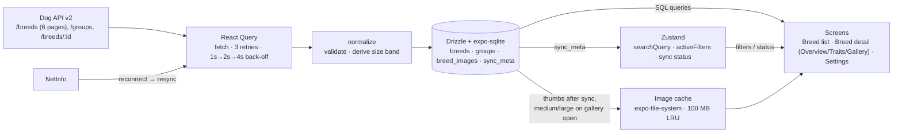

# Architecture

Tripare Dog Breed Explorer is an offline-first Expo (SDK 57) app. On first launch it pulls
the full catalogue from Dog API v2 (283 breeds, 9 groups, ~2,350 photos with attribution),
normalizes it, and writes it into a local SQLite database through Drizzle ORM. From then on
every screen reads from SQLite. The network is only used to refresh that cache: a full
resync when the data is stale or connectivity returns, and a single-breed refresh when a
detail row is old. Because the UI never renders directly from a network response, online
and offline behave identically; the only difference is the banner and image placeholders.

Server state and UI state are deliberately kept in different tools. TanStack React Query owns
fetching, retry and back-off; its results are written to SQLite before anything renders them,
so its in-memory cache is not a source of truth. Zustand owns what the user is doing right
now: the search text, the active filters, and the sync status shown in the banner. Screens
combine the two by reading SQLite through small repository functions and re-querying when the
Zustand sync store reports a write.

Images follow a two-tier cache. One thumbnail per breed is downloaded right after each sync so
the list works offline; medium and large photos are downloaded only when a gallery is opened,
under a 100 MB cap with least-recently-used eviction. The cache index lives in the same
database as the breeds, so eviction and "is this cached?" are SQL queries.

## Data flow



1. `useOfflineSync` (mounted once in the root layout after migrations) hydrates the sync
   store from `sync_meta`, runs `runSync` on launch when the cache is older than an hour, and
   again whenever NetInfo reports the device came back online.
2. `runSync` fetches groups and all breed pages through React Query's `fetchQuery` (shared
   retry policy), normalizes them, upserts into SQLite in one transaction, records the outcome
   in `sync_meta`, then prefetches primary thumbs.
3. The list reads through `useBreedsList()`: search (debounced 300 ms) and filters come from
   the Zustand filter store, one SQL query returns the rows with group name and thumb, and the
   rows are grouped into sticky sections for FlashList.
4. The detail layout loads one breed with `useBreedDetail`, which reads SQLite first and
   refreshes from `/breeds/:id` only when the row is stale (missing, no images, or older than
   24 h). Its three tab routes read the breed from context.
5. The Gallery asks the image cache for medium/large files on demand; offline, uncached
   images show a placeholder.

## `app/` vs `src/`

`app/` contains only Expo Router route files, and each one is a thin re-export of a screen
from `src/screens`. Routes stay thin for three reasons: the file name is the URL, so
keeping logic out of it makes navigation changes cheap; screens and hooks can be imported
and tested without the router; and the assessment's required layout separates routes from
the rest of the code.

```
app/                       routes only
├── _layout.tsx            migrations, QueryClientProvider, sync bootstrap, root error boundary
├── (tabs)/                bottom tabs: index (Breeds), settings
└── breed/[id]/            detail layout + nested Overview (index) / traits / gallery routes
src/
├── api/                   Dog API client, fetchers, normalizer, React Query options
├── db/                    Drizzle schema, migrations, repository (queries), sync runner
├── stores/                Zustand: filter store, sync store
├── hooks/                 useBreedsList, useBreedDetail, useOfflineSync, useCachedImage, …
├── components/            BreedRow, FilterSheet, SyncBanner, TraitGauge, CachedImage, …
├── screens/               BreedListScreen, BreedDetailLayout + tabs, SettingsScreen
├── utils/                 sizeBand, imageCache (pure policy) + expo adapter, sections, perf
├── types/                 API payload and domain types
└── __tests__/             unit, component (RNTL) and SQLite integration tests
```

## Testing

`npm test` runs Jest with three layers:

- **Unit**: size-band derivation, normalizer, retry policy, formatting, filter store, section
  builder, image-cache eviction policy.
- **Component** (React Native Testing Library): sync banner, filters, breed row, list screen,
  detail tabs, settings, offline image placeholder. The database and sync hook are mocked in
  `jest.setup.ts`; screens are driven through the Zustand stores.
- **Integration**: the real sync pipeline (normalize → upsert → `sync_meta`) against a real
  SQLite database (better-sqlite3) using the checked-in migrations and a captured 283-breed
  fixture, including the partial-failure and airplane-mode cases.
