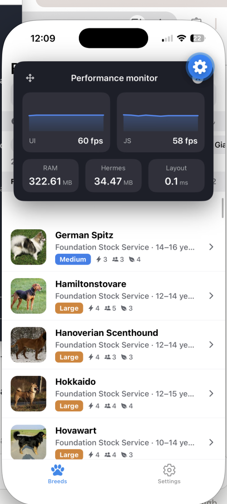

# Performance

All numbers below are measured, not estimated. Two environments were used, both on
2026-09-19:

- **Release build** (`expo prebuild` + `gradlew assembleRelease`, Hermes bytecode, no dev
  tooling) installed on a Pixel 7 API 35 Android emulator with software GL. Used for the
  process-level memory and startup numbers, because those are only meaningful for a
  standalone app.
- **Expo Go** on an iPhone 16 Pro (development bundle) with Expo's performance monitor and
  the app's built-in perf marks (Settings → Performance in dev builds). Used for frame rates
  and interaction timings.

## Targets vs measured

| Target | Measured | Status |
|---|---|---|
| Initial load to interactive with cached data < 3 s | Release build, warm start: activity displayed in **574 ms**, list with rows on screen by **~1 s** (`am start -W` + screenshots at 0.5 s intervals). Expo Go: **266–284 ms** JS start → first row | ✅ |
| 60 fps scroll through all 283 breeds | UI **60 fps**, JS **56–60 fps** (Expo Go, iPhone) | ✅ |
| Memory < 150 MB under normal use | Release build PSS (Pixel 7 API 35 emulator, re-measured 2026-09-20): **135 MB** at rest with cached data; **172 MB** after one fling pass through all 283 breeds, **186–191 MB** on the pass back up, **197 MB** settled 30 s later; **187–207 MB** during the one-time first-launch sync + thumbnail prefetch (see note) | ✅ at rest and while browsing a group or two; ❌ after scrolling the entire list once, on an emulator with no memory pressure (upper bound, see note) |
| Search / filter interaction stays smooth | UI/JS **60 fps** during typing and chip toggles; list re-query 18–55 ms | ✅ |

**Memory note.** `dumpsys meminfo` on the release build breaks the 135 MB resting PSS down
as ~9 MB Java heap, ~50 MB native heap (Hermes + SQLite + decoded thumbnails), ~47 MB code
(the JS bundle and native libraries mapped in) and ~25 MB private other. Scrolling the
whole list grows the native heap to ~103 MB and PSS to ~197 MB, and it does not come back
down while the app stays in the foreground. The growth is expo-image's Glide layer filling
its two fixed-size pools as each of the 283 thumbnails is decoded: an LRU memory cache sized
at two screens of pixels (~21 MB on a 1080×2400 display) and a bitmap pool sized at four
screens (~41 MB), neither of which expo-image exposes for tuning. Two experiments confirmed
this: raising FlashList's `drawDistance` (commit c437868) changed nothing measurable, and
switching the list thumbnails to `cachePolicy="disk"` cut the after-scroll figure by only
~15 MB (164 MB after the downward pass, ~187 MB after the return pass) while making
thumbnails visibly re-fade on the way back up, so it was not kept. The first launch is the
other exception: while the 6 API pages are parsed, 7,062 rows are inserted and 283
thumbnails are downloaded and decoded concurrently, PSS reaches 187–207 MB; this is a
one-time event and drops after a restart. Two caveats cut both ways: the emulator has no
memory pressure from other apps, so Glide never receives `onTrimMemory` and never trims its
pools, and any image surfaces a real GPU would hold in graphics memory are counted in the
native heap here. The after-scroll figures are therefore an upper bound; a real device that
browses a few groups at a time stays at the resting figure. An earlier measurement in this
document reported a 160 MB peak that settled back to ~140 MB; a full-list pass with
per-fling sampling could not reproduce that, so the numbers above replace it. Screenshot:
`screenshots/08-memory-scroll.png`. In Expo Go the Hermes heap alone was 31–39 MB; the Expo
Go process figure (322–478 MB) includes the Go shell and dev tooling and is not
representative.

## Native build time

RNRepo prebuilt artifacts (see DECISIONS.md §9) cut the Android release build from
**6 min 11 s to 2 min 25 s** on this machine (warm caches, clean `android/`, app-scoped task),
by downloading prebuilt `.aar`s for screens, reanimated, worklets, gesture-handler,
safe-area-context, netinfo and masked-view instead of compiling them.

## Bundle size

`npx expo export --platform ios --platform android` (production, Hermes bytecode):

| Output | Size |
|---|---|
| iOS JS bundle (`.hbc`) | **3.52 MB** |
| Android JS bundle (`.hbc`) | **3.80 MB** |
| Assets (53 files) | 5.0 MB |
| Export total | 12 MB |
| Android release APK, arm64-v8a, R8 + resource shrinking (the default since 2026-09-20) | **37 MB** |
| Android release APK, universal (all 4 ABIs, unminified) — the earlier default | 110 MB |

The 110 MB universal APK broke down as 81.5 MB of native libraries across four ABIs
(x86_64 22.8, x86 22.6, arm64-v8a 21.4, armeabi-v7a 14.7), 41.7 MB of unminified DEX,
5.8 MB of resources and the 3.1 MB Hermes bundle. Two changes, both made through
`expo-build-properties` in `app.json` so they survive `expo prebuild`, bring it to 37 MB:
`buildArchs: ["arm64-v8a"]` drops the two emulator-only x86 ABIs and 32-bit ARM (every
Android phone sold since 2019 is 64-bit and Play requires it), and
`enableMinifyInReleaseBuilds` + `enableShrinkResourcesInReleaseBuilds` run R8, which cut the
DEX from 41.7 MB to 14.7 MB. R8 needs one extra rule, `-dontwarn com.horcrux.svg.**`,
because react-native-gesture-handler optionally references react-native-svg classes that
this app does not install. The minified build was checked on the emulator: first sync,
list, filters, detail Overview/Traits/Gallery with attribution and paging all behave the
same, and logcat shows no JS or native errors. Resources barely shrank (5.8 → 5.7 MB); the
icon-font note below still applies. An x86 emulator (Intel host) needs `x86_64` added back
to `buildArchs`, or `-PreactNativeArchitectures=x86_64` on the Gradle command. For Play,
`./gradlew :app:bundleRelease` produces an AAB and Play serves each device only its own
split, which is smaller again.

The assets are dominated by `@expo/vector-icons` font files (every font family ships with
the package even though only Ionicons is used; MaterialIcons alone is 357 KB) and the
template's icon/splash images. Trimming the unused icon fonts is the obvious next cut if
download size matters; the JS bundle itself is small for an app with Drizzle, React Query,
FlashList and expo-image.

## Startup

**Release build, warm start with cached data** (`adb shell am start -W`): the activity is
displayed after **574 ms**; screenshots taken every 0.5 s show the splash at 0.5 s and the
full grouped list with thumbnails at 1.0 s. First-ever launch (empty cache) displayed the
activity in 3.1 s and completed the 283-breed sync in the background behind the banner.

`startup.firstRow` (in-app mark) measures from JS start to the first render that contains
breed rows, with 283 breeds already cached, in Expo Go:

| Run | ms |
|---|---|
| Cold reload 1 | 266 |
| Cold reload 2 | 284 |

That includes running Drizzle migrations, hydrating the sync store from `sync_meta`, the
first `listBreedRows` query, section building and the first FlashList layout.

## Scroll

Expo performance monitor while scrolling continuously through the full grouped list of 283
breeds (with a trait filter active in one run):

| Metric | Observed |
|---|---|
| UI thread | 58–60 fps, steady 60 once scrolling |
| JS thread | 56–60 fps |
| Layout time | 0.0–0.1 ms |
| Hermes heap | 31–39 MB |

No dropped-frame streaks were visible on either graph across the whole list.

## Search and filter interactions

| Interaction | List re-query (`list.query`) | Frame rate |
|---|---|---|
| Typing "terrier" (debounced 300 ms) | 18–27 ms | UI 60 / JS 60 |
| Toggling one size chip | 20–40 ms | UI 60 / JS 60 |
| Two chips toggled within 250 ms | 55 ms (two queries back to back) | UI 60 / JS 60 |

`list.query` is the full `listBreedRows` call: SQLite query with group and thumb joins, row
mapping, and section building. It runs on the JS thread once per filter change or sync
completion, never per frame, so a 20–55 ms query is a one-off cost per interaction, well
inside what the 300 ms search debounce and a chip tap can absorb without a visible hitch.

## Node benchmark (better-sqlite3, real migrations, 283-breed fixture)

`npm test -- perf.bench` prints these; they bound the data layer independent of device:

| Operation | Median |
|---|---|
| Normalize 283 breeds | 4 ms |
| First full sync write (283 breeds + 7,062 image rows, one transaction) | ~900 ms |
| Re-upsert of the same data | ~375 ms |
| `listBreedRows` all 283 (group + thumb joins) | 2 ms |
| `listBreedRows` search "terrier" | 1 ms |
| `listBreedRows` size + hypoallergenic filter | 1 ms |
| `getBreedDetail` (breed + 27 image rows) | 1 ms |

On device the list query is ~10× the Node number (Hermes + expo-sqlite bridge), which is why
the app queries once per interaction rather than keeping a second in-memory copy in sync.
The full sync on device (`sync.total`, 6 page fetches + write + thumb prefetch) measured
8.9 s over Wi-Fi and runs in the background behind the banner.

## What makes the list fast

- **Payload per row, not row count, is the risk.** Each breed has ~40 fields, JSON arrays and
  up to 27 image rows. The list query selects only the breed columns plus one joined group
  name and one joined thumb; images and sources are never loaded for the list.
- **Fixed, measured item sizes.** Rows are 88 pt (64 pt thumb + padding) and section headers
  36 pt, measured from a rendered row and fixed in the stylesheet. FlashList v2 (SDK 57)
  removed `estimatedItemSize` and measures items itself; deterministic heights are what keep
  its layout stable. `getItemType` keeps headers and rows in separate recycling pools.
- **One flat recycler.** Sections are a flat array with `stickyHeaderIndices`, not a nested
  SectionList. The list remounts on filter change so a new data set never inherits a stale
  layout, and FlashList v2's `maintainVisibleContentPosition` (on by default) is disabled:
  with sticky headers it tried to keep the previous first item in place when the data set
  was replaced, which left a blank gap under the header until the user scrolled.
- **Render-ahead distance.** `drawDistance` is 800 dp instead of FlashList's default 250.
  The recycler mounts rows on the JS thread as scroll events arrive, so with under three
  rows of buffer a fast fling (especially reversing direction after scrolling to the
  bottom) outran rendering and showed white space under the pinned header until it caught
  up. 800 dp keeps roughly 12 rows mounted ahead of the scroll and 5 behind, about 18
  extra rows of cheap views, which removed the gap in emulator fling tests.
- **Memoized rows, stable callbacks, small row content.** A row is a thumb, two text lines, a
  size badge and three trait badges; `BreedRow` is `memo`ized with a stable `onPress`.
- **Filtering in SQLite.** Search (name and other names), group, size band, coat length,
  hypoallergenic and trait thresholds are `WHERE` clauses on indexed columns.
- **Images.** `expo-image` with `cachePolicy="memory-disk"` and `recyclingKey`; thumbs are on
  disk after the first sync so the list renders from local files offline. Medium/large are
  fetched only when a gallery opens, under a 100 MB LRU cap.
- **Sync off the render path.** Six pages fetched in parallel after page 1; upserts in one
  transaction in chunks of 50 breeds / 200 image rows.
